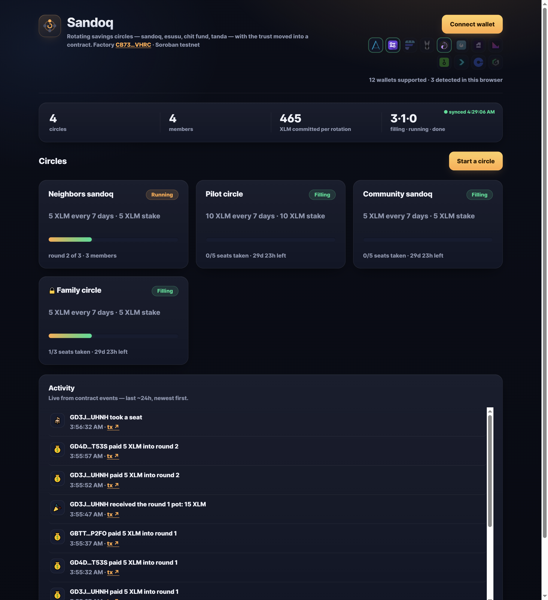
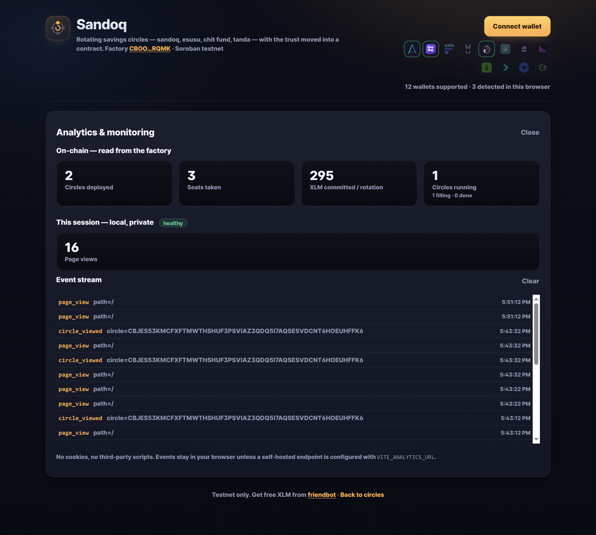
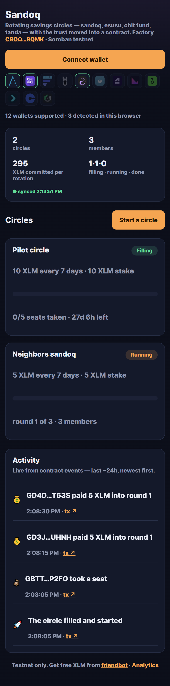
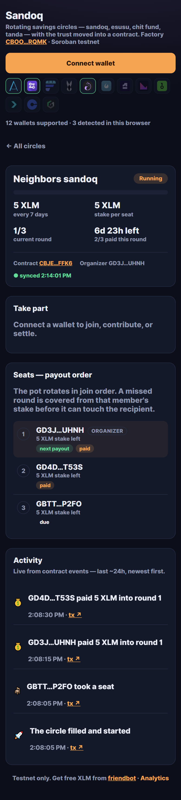
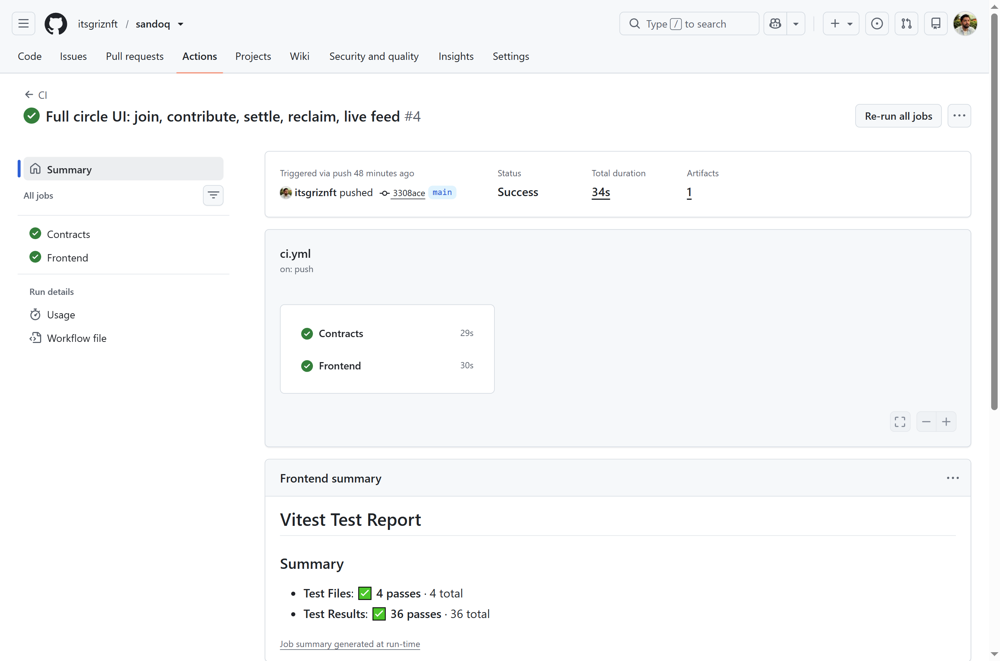
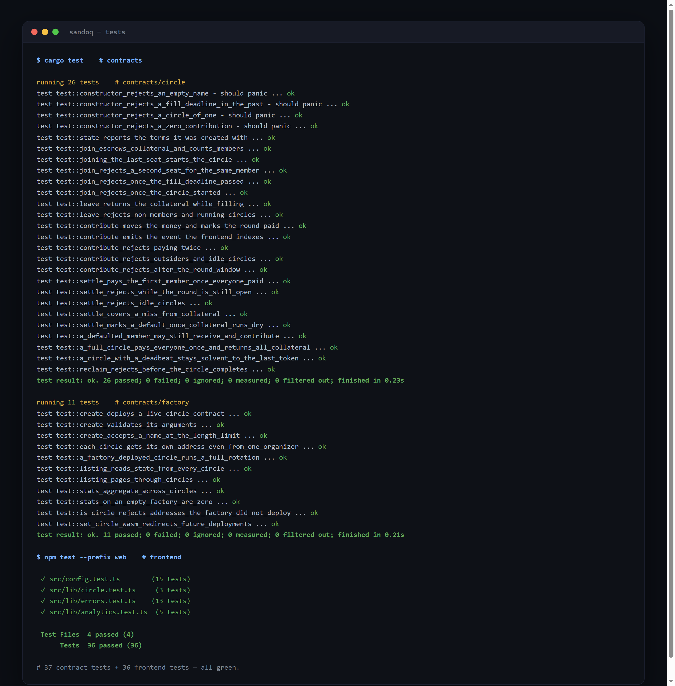

# Sandoq

[](https://github.com/itsgriznft/sandoq/actions/workflows/ci.yml)
[](https://github.com/itsgriznft/sandoq/actions/workflows/deploy.yml)

Rotating savings circles — **sandoq** in Iran, **esusu** in West Africa, **chit funds** in India,
**tandas** in Latin America — with the trust moved out of a notebook and into a Soroban contract.

A group agrees on an amount and a period. Every round each member contributes, and the whole pot
goes to one member, rotating in a fixed order until everyone has been paid exactly once. Informal
circles run on social trust and break the same few ways: an organizer disappears with the pot, a
member vanishes the round after collecting, records live in someone's head, and a dispute has no
arbiter. Sandoq keeps the social structure and removes those failure modes — **nobody, not even the
organizer, ever holds the money.**

Built for **Level 4 — Green Belt** of the [Stellar Journey to Mastery](https://www.risein.com/programs/stellar-journey-to-mastery-monthly-builder-challenges)
builder challenge. Idea approved by the Stellar Builder Team before development began.

**Live demo:** https://itsgriznft.github.io/sandoq/ · **New here?** [Join a circle in 5 minutes →](ONBOARDING.md)

---

## How a circle works

```
  fill                          run one round per period                     done
 ┌──────────┐   last seat   ┌───────────────────────────────┐   last round  ┌──────────┐
 │ Filling  │──────────────▶│            Active             │──────────────▶│ Complete │
 │          │   fills it    │  contribute → settle → rotate │   pays out    │          │
 └──────────┘               └───────────────────────────────┘               └──────────┘
   join()                     contribute()  settle()                          reclaim()
   leave()                    (a miss is covered from collateral)             (stake back)
```

1. **Join.** Each member stakes collateral to take a seat. When the last seat fills, the circle
   starts on its own — no organizer action, nothing to trust.
2. **Contribute.** Every round, every member owes one contribution before the round's window
   closes.
3. **Settle.** A permissionless crank anyone can turn once the round is paid up or its window has
   passed. The pot goes to the round's member — **in join order, which is the payout order.** Any
   member who missed has the shortfall covered from *their own* collateral first, so the recipient
   is always made whole. Only when a member's collateral is exhausted does a default reduce the
   pot — a bounded, visible, rule-based version of the loss an informal circle already absorbs.
4. **Reclaim.** When every round has paid out, each member takes back whatever collateral survived.

The contract holds exactly the collateral it still owes plus the current round's contributions, and
ends holding **zero**. That invariant is asserted after every settle in the tests.

---

## How much trust does a circle need?

A traditional savings circle needs two layers of trust: you trust the **organizer** who holds the
whole pot, and you trust **every member** to keep paying after they've been paid. In the real world
the first layer is where circles collapse — the organizer disappears with the money.

Sandoq removes that layer entirely: **the contract holds the funds, so no organizer can touch
them.** What's left is member-default risk, and that is bounded by **collateral** — a dial that
trades trust for locked capital:

| Collateral per seat | Trust needed | Who it fits |
|---|---|---|
| `0` | High — a miss immediately shrinks the pot | Family, close friends |
| `1× contribution` | Moderate — covers a member's occasional missed round | A workplace, a neighbourhood, a Telegram group |
| `size × contribution` | **None** — fully trustless | Strangers |

Why `size × contribution` is fully trustless: over the whole circle each member owes one
contribution in every one of the `size` rounds — `size × contribution` in total. A member keeps
their payout turn even if they default (the miss is taken from their collateral), so the worst case
is someone who takes the pot in the first round and then never pays cash again — their entire
obligation falls on collateral. Staking the full `size × contribution` covers every one of those
rounds, so **even a total stranger who grabs the pot and walks leaves everyone else whole.** For a
4-seat circle at 100 XLM a round that's 400 XLM staked — the size of the pot itself. The cost of
trustlessness is locking up that much up front, the same trade every over-collateralized DeFi
position makes.

> A future refinement can lower this to `(size − 1) × contribution` by requiring a member to have
> paid their own round in cash before they can receive — a design choice on the roadmap.

So Sandoq doesn't manufacture trust between strangers; it **removes the need for a trusted
organizer** and lets each circle pick where it sits on that dial. That widens who can safely run a
circle — from people who deeply trust each other to loose communities who don't. (A future on-chain
reputation — an address's record of completed circles — lets even semi-strangers size each other
up.)

---

## On-chain artifacts

Everything below is live on Stellar **testnet**.

| | |
|---|---|
| **Factory contract** | [`CBOOAEERB5DOTXXMZKURAVQXJQYTGMCJCSJWYQSPKVEWB5BSE5ZYRQMK`](https://stellar.expert/explorer/testnet/contract/CBOOAEERB5DOTXXMZKURAVQXJQYTGMCJCSJWYQSPKVEWB5BSE5ZYRQMK) |
| **Feedback registry** | [`CA3FBYWIJUJPUSU7I75M343FEDGLXNXPXIF4QUUAKKZK5NZLPETSETO7`](https://stellar.expert/explorer/testnet/contract/CA3FBYWIJUJPUSU7I75M343FEDGLXNXPXIF4QUUAKKZK5NZLPETSETO7) |
| **Circle wasm hash** | `369136f10712e04c6af13b5804aa27b56d11b58768b3d1aa1bc62739c7ec8db7` |
| **Pilot circle** (factory-deployed) | [`CCZG3DK2QP7RE76NFCLTVWVOASFYOV2X4VYN52OXQBTXHSBPT6GWJJRW`](https://stellar.expert/explorer/testnet/contract/CCZG3DK2QP7RE76NFCLTVWVOASFYOV2X4VYN52OXQBTXHSBPT6GWJJRW) |
| **`create`, from the factory** | [`41a69f5fca8c05d8efe404967456e3bbd6e7a5797782a9af3bfdf5dce63f50e2`](https://stellar.expert/explorer/testnet/tx/41a69f5fca8c05d8efe404967456e3bbd6e7a5797782a9af3bfdf5dce63f50e2) |
| **Circle token** | Native XLM, via its Stellar Asset Contract |

The recorded wasm hash is reproducible: `make build` on this tree produces a `circle.wasm` whose
sha256 is exactly the hash the factory deploys from.

---

## Why Stellar

- **Payments-first.** ~5s finality and near-zero fees make small monthly contributions economically
  viable — they are not, on chains where a contribution can cost more than a contribution.
- **Anchors for the last mile.** Members enter and exit in local currency through SEP-24 anchors
  while the circle settles in a stable asset — the wallet-to-cash link informal savers actually
  need. (On the roadmap; the MVP settles in native XLM.)
- **Soroban for the logic.** Escrow, a factory that deploys one contract per circle, cross-contract
  aggregation, and nested token calls — the exact patterns proven in my
  [Yellow](https://github.com/itsgriznft/stellar-crowdfund) and
  [Orange](https://github.com/itsgriznft/stellar-launchpad) belt projects, now carrying real
  savings.

---

## Screenshots

**Circles** — every card and the header stats are cross-contract reads from the factory.



**A circle** — seat grid in payout order, per-round timeline, and actions scoped to what the
connected wallet can do right now.


**Analytics & monitoring** — on-chain metrics from `stats()` alongside a private, in-browser event
stream that also captures errors.



**Feedback — on-chain and verifiable.** Every response is a signed transaction to the feedback
registry, so the community summary is read straight from the ledger, with each note's author
linked to Stellar Expert.


**Mobile** — single column, 44px targets, no horizontal scroll at any width from 320px up.

<p>
  
  
</p>

**CI/CD** — every push runs `cargo fmt --check`, the ordered contract build, 47 contract tests,
then the frontend's lint, 38 tests, and production build. `main` deploys to GitHub Pages.



**Tests** — 47 contract tests and 38 frontend tests, all green. Full output in
[screenshots/test-output.txt](screenshots/test-output.txt).



---

## Inter-contract communication

Three distinct kinds of contract-to-contract calls, the same architecture as the launchpad:

```
                    ┌──────────────────────────────────────────┐
                    │              Factory                     │
                    │  create()  listing()  stats()            │
                    └───┬──────────────┬───────────────────────┘
       1. deploy_v2 +   │              │  2. cross-contract read
          constructor   │              │     state()
                        ▼              ▼
                    ┌──────────────────────────────────────────┐
                    │        Circle (one per savings group)    │
                    │  join contribute settle reclaim          │
                    └───────────────────┬──────────────────────┘
                                        │  3. nested token call
                                        ▼     transfer()
                    ┌──────────────────────────────────────────┐
                    │   Stellar Asset Contract (native XLM)    │
                    └──────────────────────────────────────────┘
```

1. **Deployment.** `Factory::create` calls `deploy_v2` with the circle wasm hash and the
   constructor arguments, so a new circle exists and is initialised in one transaction. The address
   is derived from a salt over `(organizer, index)`, so one organizer can run several circles
   without collisions.
2. **Cross-contract reads.** `Factory::listing` and `Factory::stats` call `state()` on each deployed
   circle and aggregate the answers, capped at 50 per call with `aggregated` reporting how many were
   summed — a partial total is never silently passed off as complete.
3. **Nested token calls.** Every `join`, `contribute`, `settle` and `reclaim` moves funds through
   the token contract. A short balance reverts the whole invocation, which is where the frontend's
   `INSUFFICIENT_BALANCE` ultimately comes from.

The factory stores only the circle's *wasm hash*. A deployed circle is an ordinary, independent
contract afterwards — the factory cannot touch its funds.

---

## The contracts

### `contracts/circle`

| Function | Auth | Description |
|---|---|---|
| `__constructor(token, organizer, name, contribution, period, size, collateral, fill_deadline)` | — | Rejects a bad size (2–24), non-positive contribution, zero period, or a past deadline |
| `join(member)` | member | Stakes collateral, takes a seat; the last seat starts the circle |
| `leave(member)` | member | Refunds the stake — only while still filling, so seats are never abandoned mid-game |
| `contribute(member)` | member | Pays the current round; only inside its window, only once |
| `settle()` | — | Permissionless crank: covers misses from collateral, pays the pot to the round's member, rotates |
| `reclaim(member)` | member | Returns surviving collateral once the circle completes |
| `state()` / `members()` / `member(addr)` / `has_paid(round, addr)` | — | Reads for the frontend |

Events: `joined`, `left`, `started`, `contributed`, `slashed`, `paid_out`, `completed`,
`reclaimed` — each carrying the member address as an indexed topic where it has one.

### `contracts/factory`

| Function | Auth | Description |
|---|---|---|
| `__constructor(admin, token, circle_wasm)` | — | Pins the wasm every circle is deployed from |
| `create(organizer, name, contribution, period, size, collateral, fill_deadline)` | organizer | Deploys a circle, returns its address, emits `created` |
| `listing(start, limit)` | — | Pages the circles, reading `state()` from each |
| `stats()` | — | Totals across the circles: counts by status, members, XLM committed per rotation |
| `circles()` / `is_circle(address)` | — | What this factory deployed |
| `set_circle_wasm(wasm)` | admin | Redirects *future* deployments; existing circles are untouched |

### `contracts/feedback`

A standalone registry that makes user feedback a **public, verifiable ledger record** rather than
something the team asserts. Submitting is a signed transaction, so each response carries its own tx
hash and author address.

| Function | Auth | Description |
|---|---|---|
| `submit(author, sentiment, role, note)` | author | Stores one entry under the author (1–5 sentiment, role, ≤280-char note); re-submitting updates in place. Emits `submitted` |
| `summary()` | — | Distinct-author count, summed sentiment (for the average), and the role breakdown |
| `list(start, limit)` / `entry(addr)` / `count()` / `authors()` | — | Reads for the community view |

One entry per address, so the **count equals the number of distinct people** who left feedback —
which is exactly the "proof of user interactions" a reviewer can verify. Read it yourself:

```bash
stellar contract invoke --id CA3FBYWIJUJPUSU7I75M343FEDGLXNXPXIF4QUUAKKZK5NZLPETSETO7 \
  --source <any> --network testnet -- summary
```

---

## Frontend integration — code walkthrough

Reviewers have flagged before that automated file sampling can skip the frontend integration files,
so here is exactly where the wallet and `@stellar/stellar-sdk` code lives, and how each contract
function is called from the UI. All of it is in this repository.

| File | Responsibility |
|---|---|
| [`web/src/lib/wallet.ts`](web/src/lib/wallet.ts) | Stellar Wallets Kit init, connect modal, signing |
| [`web/src/lib/rpc.ts`](web/src/lib/rpc.ts) | Generic simulate/sign/submit/confirm pipeline over `@stellar/stellar-sdk` |
| [`web/src/lib/factory.ts`](web/src/lib/factory.ts) | `create`, `listing`, `stats` against the factory |
| [`web/src/lib/circle.ts`](web/src/lib/circle.ts) | `join`, `contribute`, `settle`, `reclaim`, seats, event paging per circle |
| [`web/src/lib/analytics.ts`](web/src/lib/analytics.ts) | Event tracking + global error monitoring |
| [`web/src/lib/errors.ts`](web/src/lib/errors.ts) | Classifies wallet / contract / network failures |
| [`web/src/hooks/`](web/src/hooks/) | `useWallet`, `useSandoq`, `useCircle`, `useCircleEventsFeed` |

**Every write path the frontend calls, and where:**

| Contract function | Frontend caller |
|---|---|
| `Factory::create` | `createCircle()` in [`factory.ts`](web/src/lib/factory.ts) — signed, returns the new address |
| `Circle::join` | `join()` in [`circle.ts`](web/src/lib/circle.ts) |
| `Circle::leave` | `leave()` in [`circle.ts`](web/src/lib/circle.ts) |
| `Circle::contribute` | `contribute()` in [`circle.ts`](web/src/lib/circle.ts) |
| `Circle::settle` | `settle()` in [`circle.ts`](web/src/lib/circle.ts) |
| `Circle::reclaim` | `reclaim()` in [`circle.ts`](web/src/lib/circle.ts) |
| `state` / `members` / `stats` / events | free simulations and `server.getEvents` |

**Connecting a wallet** — [`web/src/lib/wallet.ts`](web/src/lib/wallet.ts):

```ts
export async function connect(): Promise<string> {
  initWallets();   // StellarWalletsKit.init({ modules: defaultModules(), network: Networks.TESTNET, … })
  try {
    const { address } = await StellarWalletsKit.authModal();
    if (!address) throw new AppError('WALLET_NOT_FOUND', 'The wallet did not return an address.');
    return address;
  } catch (error) {
    throw classifyError(error);   // USER_REJECTED / WALLET_NOT_FOUND / …
  }
}
```

**The write pipeline** — [`web/src/lib/rpc.ts`](web/src/lib/rpc.ts) is the single path every signed
call takes: build with `TransactionBuilder`, `prepareTransaction` (simulation + Soroban auth),
wallet signature, `sendTransaction`, then poll `getTransaction` to a final verdict, reporting each
stage to the UI:

```ts
export async function invoke(source, contractId, method, args, sign, onStage) {
  onStage({ stage: 'simulating' });
  const account = await server.getAccount(source);
  const tx = new TransactionBuilder(account, { fee: BASE_FEE, networkPassphrase: NETWORK_PASSPHRASE })
    .addOperation(new Contract(contractId).call(method, ...args))
    .setTimeout(TX_VALID_SECONDS)          // 300s — the user still has to read the wallet prompt
    .build();
  const prepared = await server.prepareTransaction(tx);

  onStage({ stage: 'signing' });
  const signedXdr = await sign(prepared.toXDR());          // wallet.ts signTransaction

  onStage({ stage: 'submitting' });
  const sent = await server.sendTransaction(
    TransactionBuilder.fromXDR(signedXdr, NETWORK_PASSPHRASE) as Transaction,
  );
  if (sent.status === 'ERROR') throw transactionResultError(resultCode(sent.errorResult));

  onStage({ stage: 'confirming', hash: sent.hash });
  const result = await waitForTransaction(sent.hash);
  onStage({ stage: 'success', hash: sent.hash });
  return { hash: sent.hash, returnValue: scValToNative(result.returnValue) };
}
```

**Calling a circle** — [`web/src/lib/circle.ts`](web/src/lib/circle.ts) rides that pipeline for
every write. `settle` is deliberately callable by anyone — the connected wallet only pays the fee:

```ts
export async function contribute(circle, member, sign, onStage) {
  const { hash } = await invoke(member, circle, 'contribute', [addressArg(member)], sign, onStage);
  return hash;
}

export async function settle(circle, caller, sign, onStage) {
  const { hash } = await invoke(caller, circle, 'settle', [], sign, onStage);   // pot → round's member
  return hash;
}
```

---

## Real-time updates, errors, mobile

**Real-time.** The activity feed and every progress bar are driven by polling `getEvents` from a
cursor. A contribution or payout made by anyone — from this UI or the CLI — appears within about
five seconds without a reload.

**Errors** are classified rather than dumped: `USER_REJECTED`, `INSUFFICIENT_BALANCE` (caught before
signing and again from the token's `BalanceError`), `ACCOUNT_NOT_FUNDED`, `CONTRACT_REJECTED`
(circle full, round closed, nothing to reclaim…), and `NETWORK` (including decoded transaction
result codes like `txTooLate`). Transactions stay valid for five minutes so a slow wallet prompt
doesn't expire them.

**Analytics & monitoring** ([`web/src/lib/analytics.ts`](web/src/lib/analytics.ts)) is
self-contained and privacy-first: typed events fan out to a local ring buffer, an optional
`VITE_ANALYTICS_URL` beacon endpoint, and the console; global error and rejection handlers feed the
same pipe. The in-app panel shows on-chain metrics from `stats()` next to the session stream. No
cookies, no third-party scripts.

**Mobile.** Single column below 900px, 44px tap targets, no horizontal scroll from 320px up.

---

## Running it locally

**Prerequisites:** [Rust](https://rustup.rs/) with the `wasm32v1-none` target, Node 24+, and
optionally the [Stellar CLI](https://developers.stellar.org/docs/tools/developer-tools/cli/install-cli).

```bash
rustup target add wasm32v1-none
```

### Contracts

```bash
make build   # circle wasm first, then factory — the order matters
make test    # 47 unit tests
```

> The factory embeds the circle's contract spec via `contractimport!`, so the circle wasm must exist
> before the factory can compile. `make` encodes that ordering.

### Deploy your own registry

```bash
./scripts/deploy.sh testnet
```

That uploads the circle wasm, deploys a factory pointing at the hash, and writes the ids to
`deployments/testnet.json`. Then start a circle:

```bash
stellar contract invoke --id <FACTORY_ID> --source deployer --network testnet \
  -- create --organizer "$(stellar keys address deployer)" \
  --name "Family sandoq" --contribution 100000000 --period 604800 \
  --size 5 --collateral 100000000 --fill_deadline $(( $(date +%s) + 604800 ))
```

Amounts are in **stroops** (1 XLM = 10,000,000 stroops); `period` and `fill_deadline` are seconds.

### Frontend

```bash
cd web
npm install
npm run dev      # http://localhost:5173
npm test         # 38 unit tests
npm run lint
```

Point it at your own factory with `VITE_FACTORY_ID`; otherwise it uses the one above. Set
`VITE_ANALYTICS_URL` to forward analytics beacons to your own endpoint.

---

## Layout

```
contracts/circle/        one savings group: join, contribute, settle, reclaim, events
contracts/factory/       deploys circles, aggregates their state
scripts/deploy.sh        upload wasm -> deploy factory -> record ids
deployments/             what is live, per network
web/src/lib/rpc.ts       simulate / sign / submit / confirm
web/src/lib/circle.ts    join, contribute, settle, reclaim, event paging
web/src/lib/factory.ts   listing, stats, create
web/src/lib/analytics.ts event tracking + error monitoring
web/src/hooks/           polling for the registry and one circle
.github/workflows/       CI (fmt, tests, lint, build) and Pages deploy
```

## Notes

- `ed25519-dalek` is pinned to 2.2.0 in `Cargo.lock`: `soroban-env-host` declares an open
  `>=2.0.0` requirement, and 3.0.0 changed the `rand_core` bounds its test PRNG relies on.
- A defaulted member keeps their payout turn: their misses were already taken out of the pot when
  their collateral was slashed, so paying them their round changes nothing for anyone else. The
  contract stops trusting them for *coverage*, not for participation.
- Testnet data is periodically reset. If the contract addresses 404, redeploy with `./scripts/deploy.sh`.

## License

MIT
